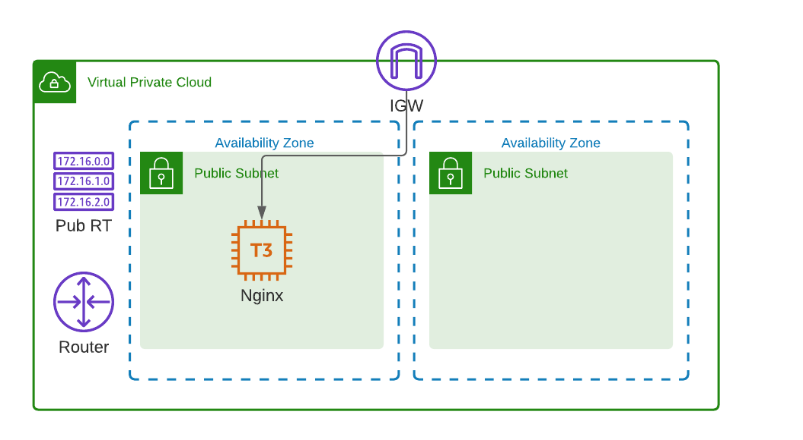
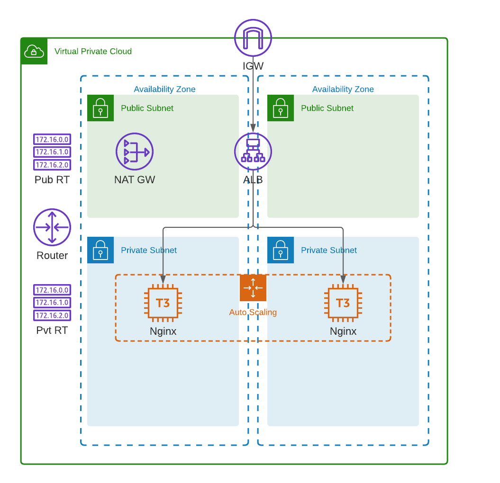

# CloudAcademy Terraform 1.x AWS Course
This repo contains example Terraform configurations for building AWS infrastructure.

## AWS Exercises
The exercises directory contains 4 different AWS infrastructure provisioning exercises. 

### Exercise 1
Create a simple AWS VPC spanning 2 AZs. Public subnets will be created, together with an internet gateway, and single route table. A t3.micro instance will be deployed and installed with Nginx for web serving. Security groups will be created and deployed to secure all network traffic between the various components.

https://github.com/cloudacademy/terraform-aws/tree/main/exercises/exercise1



#### Project Structure

```
├── main.tf
├── outputs.tf
├── terraform.tfvars
└── variables.tf
```

### Exercise 2
Create an advanced AWS VPC spanning 2 AZs with both public and private subnets. An internet gateway and NAT gateway will be deployed into it. Public and private route tables will be established. An application load balancer (ALB) will be installed which will load balance traffic across an auto scaling group (ASG) of Nginx web servers. Security groups will be created and deployed to secure all network traffic between the various components.

https://github.com/cloudacademy/terraform-aws/tree/main/exercises/exercise2



#### Project Structure

```
├── ec2.userdata
├── main.tf
├── outputs.tf
├── terraform.tfvars
└── variables.tf
```

### Exercise 3
Same AWS architecture as used in Exercise 2. This exercise demonstrates a different Terraform technique, using the Terraform "count" meta argument, for configuring the public and private subnets as well as their respective route tables.

https://github.com/cloudacademy/terraform-aws/tree/main/exercises/exercise3


#### Project Structure

```
├── ec2.userdata
├── main.tf
├── outputs.tf
├── terraform.tfvars
└── variables.tf
```

### Exercise 4
Create an advanced AWS VPC to host a fully functioning cloud native application.


The VPC will span 2 AZs, and have both public and private subnets. An internet gateway and NAT gateway will be deployed into it. Public and private route tables will be established. An application load balancer (ALB) will be installed which will load balance traffic across an auto scaling group (ASG) of Nginx web servers installed with the cloud native application frontend and API. A database instance running MongoDB will be installed in the private zone. Security groups will be created and deployed to secure all network traffic between the various components.

For demonstration purposes only - both the frontend and the API will be deployed to the same set of ASG instances - to reduce running costs.

https://github.com/cloudacademy/terraform-aws/tree/main/exercises/exercise4


The auto scaling web application layer bootstraps itself with both the [Frontend](https://github.com/cloudacademy/voteapp-frontend-react-2020) and [API](https://github.com/cloudacademy/voteapp-api-go) components by pulling down their **latest** respective releases from the following repos:

* Frontend: https://github.com/cloudacademy/voteapp-frontend-react-2020/releases/latest

* API: https://github.com/cloudacademy/voteapp-api-go/releases/latest

The bootstrapping process for the [Frontend](https://github.com/cloudacademy/voteapp-frontend-react-2020) and [API](https://github.com/cloudacademy/voteapp-api-go) components is codified within a ```template_cloudinit_config``` block located in the application module's [main.tf](./modules/application/main.tf) file:

```terraform
data "template_cloudinit_config" "config" {
  gzip          = false
  base64_encode = false

  #userdata
  part {
    content_type = "text/x-shellscript"
    content      = <<-EOF
    #! /bin/bash
    apt-get -y update
    apt-get -y install nginx
    apt-get -y install jq

    ALB_DNS=${aws_lb.alb1.dns_name}
    MONGODB_PRIVATEIP=${var.mongodb_ip}
    
    mkdir -p /tmp/cloudacademy-app
    cd /tmp/cloudacademy-app

    echo ===========================
    echo FRONTEND - download latest release and install...
    mkdir -p ./voteapp-frontend-react-2020
    pushd ./voteapp-frontend-react-2020
    curl -sL https://api.github.com/repos/cloudacademy/voteapp-frontend-react-2020/releases/latest | jq -r '.assets[0].browser_download_url' | xargs curl -OL
    INSTALL_FILENAME=$(curl -sL https://api.github.com/repos/cloudacademy/voteapp-frontend-react-2020/releases/latest | jq -r '.assets[0].name')
    tar -xvzf $INSTALL_FILENAME
    rm -rf /var/www/html
    cp -R build /var/www/html
    cat > /var/www/html/env-config.js << EOFF
    window._env_ = {REACT_APP_APIHOSTPORT: "$ALB_DNS"}
    EOFF
    popd

    echo ===========================
    echo API - download latest release, install, and start...
    mkdir -p ./voteapp-api-go
    pushd ./voteapp-api-go
    curl -sL https://api.github.com/repos/cloudacademy/voteapp-api-go/releases/latest | jq -r '.assets[] | select(.name | contains("linux-amd64")) | .browser_download_url' | xargs curl -OL
    INSTALL_FILENAME=$(curl -sL https://api.github.com/repos/cloudacademy/voteapp-api-go/releases/latest | jq -r '.assets[] | select(.name | contains("linux-amd64")) | .name')
    tar -xvzf $INSTALL_FILENAME
    #start the API up...
    MONGO_CONN_STR=mongodb://$MONGODB_PRIVATEIP:27017/langdb ./api &
    popd

    systemctl restart nginx
    systemctl status nginx
    echo fin v1.00!

    EOF    
  }
}
```

#### ALB Target Group Configuration

The ALB will configured with a single Listener listening on port 80. 2 target groups will be established. The frontend target group points to the Nginx web server (port 80). The API target group points to the custom API service (port 8080). 


#### Project Structure

```
├── main.tf
├── modules
│   ├── application
│   │   ├── main.tf
│   │   ├── outputs.tf
│   │   └── vars.tf
│   ├── bastion
│   │   ├── main.tf
│   │   ├── outputs.tf
│   │   └── vars.tf
│   ├── network
│   │   ├── main.tf
│   │   ├── outputs.tf
│   │   └── vars.tf
│   ├── security
│   │   ├── main.tf
│   │   ├── outputs.tf
│   │   └── vars.tf
│   └── storage
│       ├── install.sh
│       ├── main.tf
│       ├── outputs.tf
│       └── vars.tf
├── outputs.tf
├── terraform.tfvars
└── variables.tf
```