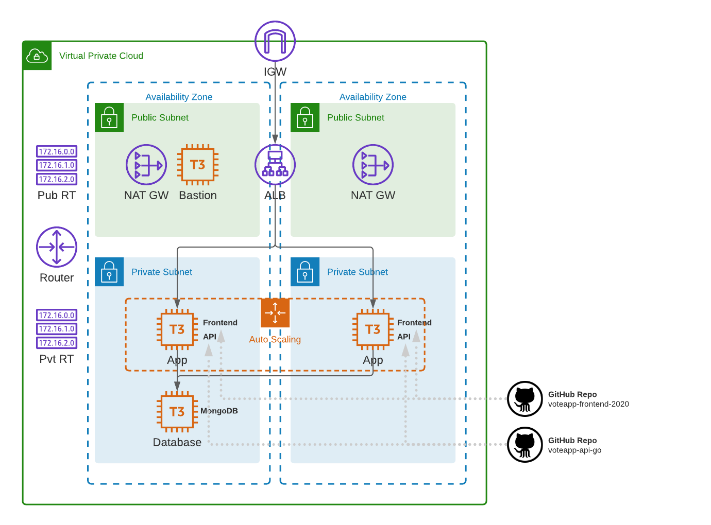

# CloudAcademy Terraform 1.x AWS Course
This repo contains example Terraform configurations for building AWS infrastructure.

## AWS Exercises
The exercises directory contains 4 different AWS infrastructure provisioning exercises. 

### Exercise 1
Create a simple AWS VPC spanning 2 AZs. Public subnets will be created, together with an internet gateway, and single route table. A t3.micro instance will be deployed and installed with Nginx for web serving.

https://github.com/cloudacademy/terraform-aws/tree/main/exercises/exercise1

### Exercise 2
Create an advanced AWS VPC spanning 2 AZs with both public and private subnets. An internet gateway and NAT gateway will be deployed into it. Public and private route tables will be established. An application load balancer (ALB) will be installed which will load balance traffic across an auto scaling group (ASG) of Nginx web servers.

https://github.com/cloudacademy/terraform-aws/tree/main/exercises/exercise2

### Exercise 3
Same AWS architecture as used in Exercise 2. This exercise demonstrates a different Terraform technique, using the Terraform "count" meta argument, for configuring the public and private subnets as well as their respective route tables.

https://github.com/cloudacademy/terraform-aws/tree/main/exercises/exercise3

### Exercise 4
Create an advanced AWS VPC to host a fully functioning cloud native application. The VPC will span 2 AZs, and have both public and private subnets. An internet gateway and NAT gateway will be deployed into it. Public and private route tables will be established. An application load balancer (ALB) will be installed which will load balance traffic across an auto scaling group (ASG) of Nginx web servers installed with the cloud native application frontend and API. A database instance running MongoDB will be installed in the private zone.

https://github.com/cloudacademy/terraform-aws/tree/main/exercises/exercise4

The auto scaling web application layer bootstraps itself with both the frontend and api components by pulling down the latest respective releases from the following repos:

* Frontend: https://github.com/cloudacademy/voteapp-frontend-react-2020/releases/latest

* API: https://github.com/cloudacademy/voteapp-api-go/releases/latest
